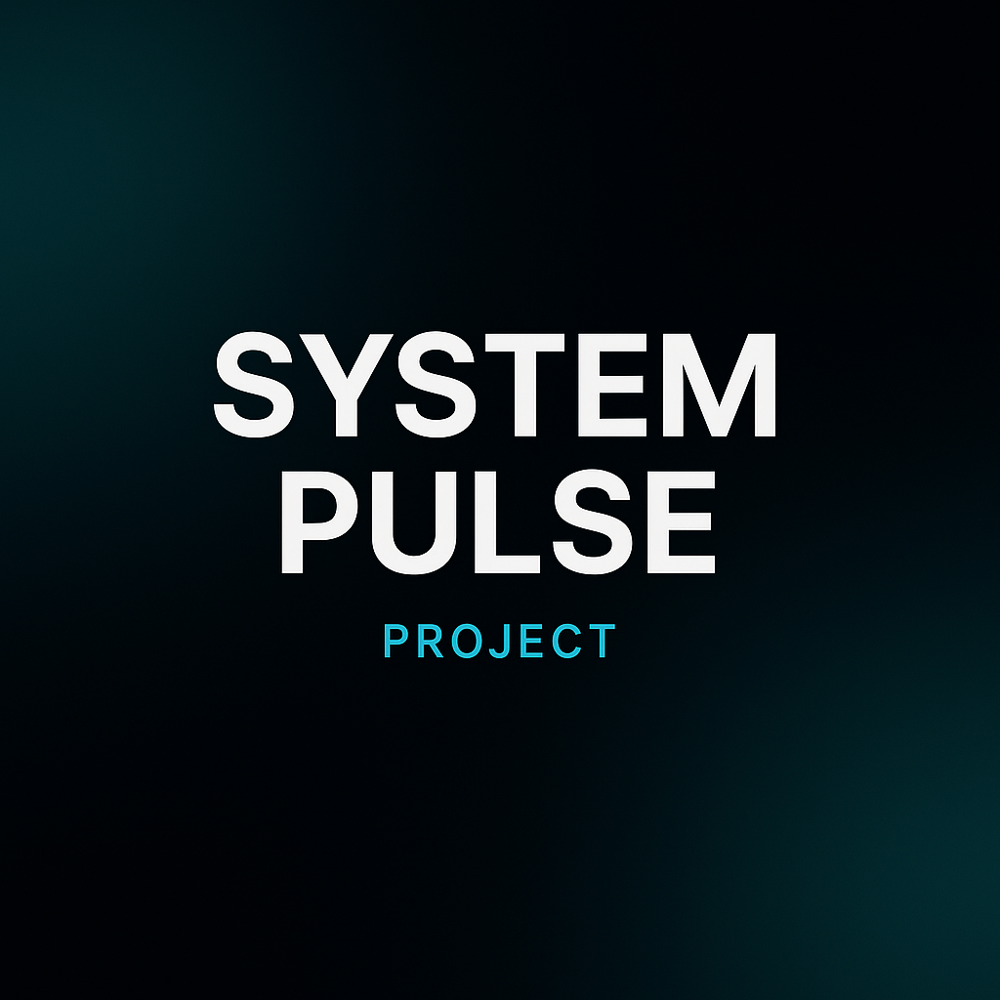
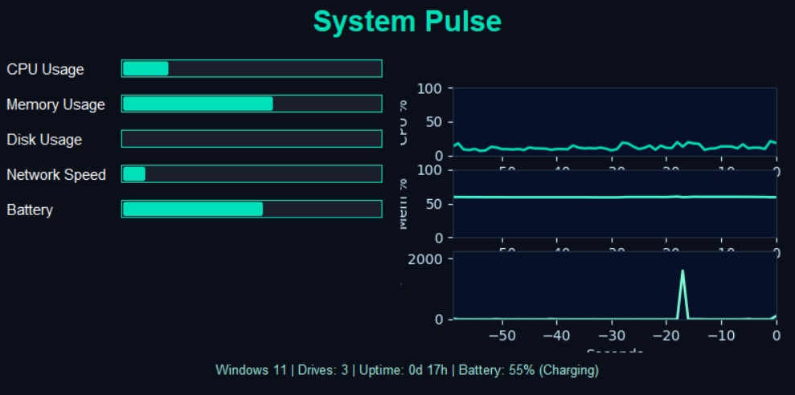

<!-- PROJECT BANNER -->
<p align="center">
  
</p>

<h1 align="center">⚡ System Pulse – Real-Time System Monitor</h1>

<p align="center">
  A futuristic <b>Python + Tkinter + psutil + matplotlib</b> based desktop app that monitors your system’s performance in real-time — CPU, Memory, Disk, Network & Battery — with dynamic graphs and an elegant Aqua Cyan theme 🌌.  
  <br/>
  <a href="#demo">View Demo</a> •
  <a href="#installation">Installation</a> •
  <a href="#features">Features</a> •
  <a href="#tech-stack">Tech Stack</a> •
  <a href="#author">Author</a>
</p>

---

## 🚀 Overview

**System Pulse** is a lightweight, visually dynamic real-time performance dashboard that tracks your system’s vital metrics in one futuristic interface.  
It combines **multi-threaded performance monitoring**, **real-time matplotlib graphs**, and **a glowing Aqua Cyan UI** for an elegant and modern feel.  

<p align="center">
  
</p>

---

## 🧠 Features

✅ Real-time tracking of **CPU, Memory, Disk, Network & Battery**  
✅ **Dynamic graph updates** for CPU %, Memory %, and Network KB/s  
✅ **Color-changing disk bar** (green → yellow → red) for usage intensity  
✅ Multi-threaded updates — zero lag or UI freeze  
✅ Fully cross-platform (**Windows, macOS, Linux**)  
✅ Clean **Tkinter + Matplotlib** based interface  
✅ Extensible architecture — ready for ML-based anomaly detection  

---

## 🛠️ Tech Stack

| Component | Purpose |
|------------|----------|
| **Python 3.12+** | Core language |
| **Tkinter** | GUI framework |
| **psutil** | System resource tracking |
| **matplotlib** | Live data visualization |
| **threading** | Background async data collection |

---

## ⚙️ Installation

### 1️⃣ Clone the Repository
```bash
git clone https://github.com/nischithkashyap98-code/SystemPulse.git
cd SystemPulse

2️⃣ Set up a virtual environment

Windows:

python -m venv venv
venv\Scripts\activate


macOS / Linux:

python3 -m venv venv
source venv/bin/activate

3️⃣ Install dependencies
pip install -r requirements.txt

4️⃣ Run the app
python system_pulse.py


💡 Optional (no console window):

pythonw system_pulse.py

💫 Demo
Dark Mode	Real-Time Graphs

	
🌌 Project Structure
SystemPulse/
│
├── system_pulse.py       # Main application
├── requirements.txt      # Dependencies
├── README.md             # Documentation
├── .gitignore            # Ignored files
└── assets/
    ├── banner.png
    ├── demo.png
    └── demo_light.png

📊 Sample Output
System Pulse ⚡
CPU: 45% | RAM: 63% | Disk: 72%
Network: 120 KB/s | Battery: 82% (Charging)
Uptime: 0d 5h 42m

🧩 Future Enhancements

📈 Gradient line charts

🌗 Dark/Light theme toggle

🔔 High CPU temperature alerts

🧠 ML-based anomaly prediction

🧰 Export performance logs

🧑‍💻 Author

Nischith Kashyap S
🎯 Software Engineer | DevOps Engineer | Mechanical Innovator

📬 Email

💼 LinkedIn

💻 GitHub

🌐 Portfolio

💬 Support & Feedback

If you like this project, please ⭐ star the repository — it helps a lot!
Pull requests, feature ideas, and improvements are always welcome 🙌

🧠 “Monitor smart. Optimize smarter.”
— Nischith Kashyap S
